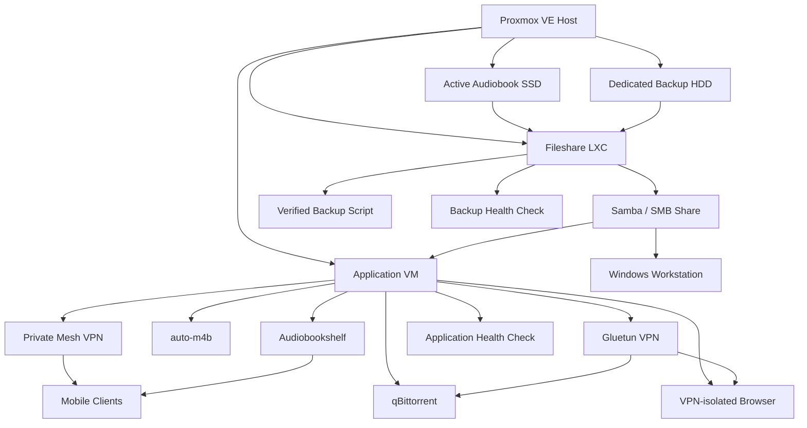
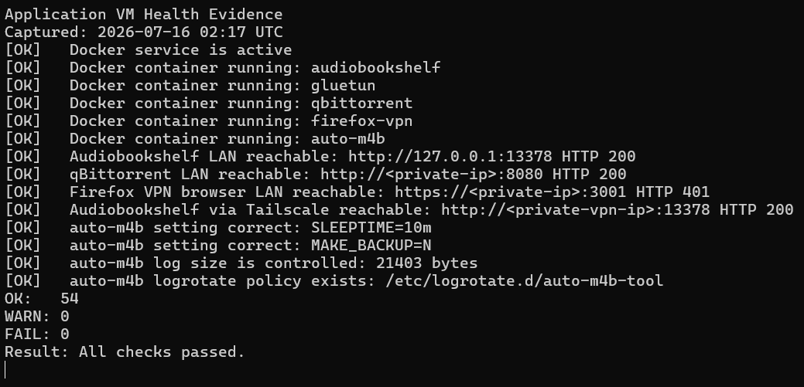
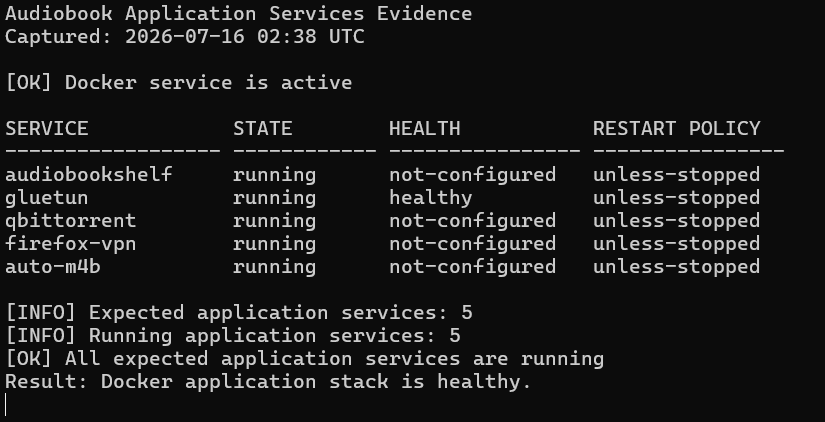
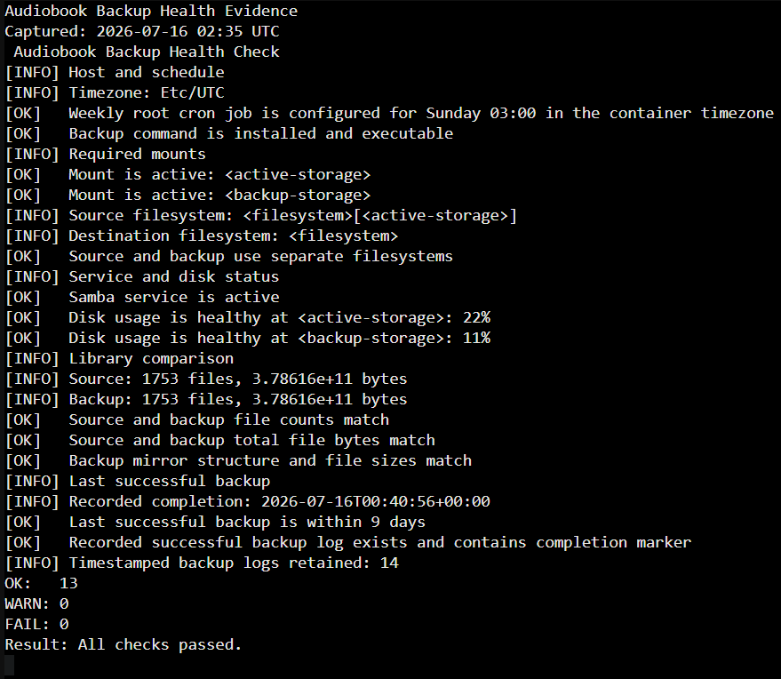
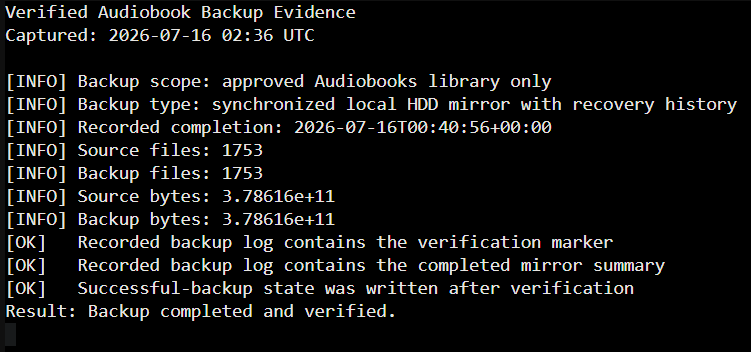

# Self-Hosted Audiobook Server and Fileshare Case Study

## Table of Contents

- [Project Summary](#project-summary)
- [Library Sources and Content Policy](#library-sources-and-content-policy)
- [Current Architecture](#current-architecture)
- [Core Components](#core-components)
- [Storage Model](#storage-model)
- [Operational Workflow](#operational-workflow)
- [Backup Design](#backup-design)
- [Health Checks and Maintenance](#health-checks-and-maintenance)
- [Security and Access Model](#security-and-access-model)
- [Evidence Included](#evidence-included)
- [Problems Solved](#problems-solved)
- [Skills Demonstrated](#skills-demonstrated)
- [Future Improvements](#future-improvements)
- [License](#license)
- [Sanitization Notice](#sanitization-notice)

---

## Project Summary

This project documents a self-hosted audiobook platform running on a mini PC with Proxmox VE. The current design separates application services from file sharing and backup operations:

- A dedicated Ubuntu Server VM runs Audiobookshelf, audiobook conversion, download services, private remote access, and application health checks.
- A dedicated Debian LXC runs Samba, mounts the active storage SSD and backup HDD, and performs verified weekly backups.
- A Windows workstation is used for intentional manual review, chapter-order preparation, and final quality assurance.

The environment originally included a general media-server dependency, metadata-processing automation, redundant staging scripts, and overlapping backup mechanisms. Those components were retired after the replacement workflow was tested and verified.

The resulting system favors clear data ownership, manual quality gates, recoverable backups, and straightforward troubleshooting.

---

## Library Sources and Content Policy

The personal library used with this project contains only:

- **Public-domain audiobook recordings obtained from Internet Archive**, including items that Internet Archive makes available through BitTorrent distribution.
- **Audiobooks purchased and owned by the project operator through Audible**, imported into the personal self-hosted library.

qBittorrent is used to retrieve public-domain Internet Archive releases distributed through BitTorrent. It is not used to obtain unauthorized copies of copyrighted audiobooks.

This repository documents the server architecture, workflow, health checks, and backup design only. It does not contain audiobook media, torrent files, magnet links, account credentials, or instructions for obtaining copyrighted works without authorization.

---

## Current Architecture



### High-Level Layout

| Layer | Current role |
|---|---|
| Proxmox VE host | Runs the application VM and fileshare LXC and presents the physical storage devices |
| Application VM | Runs Audiobookshelf, auto-m4b, the VPN-routed download stack, private remote access, and the application health check |
| Fileshare LXC | Runs Samba and owns the active-storage and backup-storage mount points |
| Active SSD | Stores source files, temporary workspaces, and the approved audiobook library |
| Backup HDD | Stores the verified Audiobooks mirror, recovery history, logs, and the last-successful-backup state |
| Windows workstation | Provides the manual preparation and quality-control interface through SMB |

The retired media-server container is not part of the current architecture.

---

## Core Components

### Proxmox VE

Proxmox VE provides the virtualization layer and controlled startup order. The fileshare LXC starts before the application VM so the SMB-backed workspace is available when application services initialize.

### Application VM

The application VM runs the active services:

- **Audiobookshelf** for library browsing, playback, user access, and metadata matching.
- **auto-m4b** for converting manually prepared MP3 folders into chapterized M4B files.
- **qBittorrent** for retrieving public-domain Internet Archive releases made available through BitTorrent.
- **Gluetun** for VPN routing and forwarded-port management for the download stack.
- **VPN-isolated browser** for private browser activity associated with the download workflow.
- **Private mesh VPN client** for remote access without exposing services directly to the public internet.

A custom health-check command verifies the active containers, the shared workspace, service reachability, VPN status, conversion settings, workflow directories, and log management.

### Audiobookshelf

Audiobookshelf is the authoritative application for the approved library. After conversion and manual quality assurance, it is used to:

- Scan the final library.
- Match books and authors.
- Correct or customize metadata.
- Validate playback, chapters, artwork, and completeness.

The retired metadata-processing container is no longer required.

### Fileshare LXC

The dedicated fileshare LXC runs Samba and exposes the audiobook workspace to the application VM and Windows workstation.

Its responsibilities are deliberately limited to:

- SMB file sharing.
- Active SSD access.
- Backup HDD access.
- Weekly Audiobooks-only backup execution.
- Backup health validation.

---

## Storage Model

The active SSD has three distinct data roles.

| Area | Purpose | Backup policy |
|---|---|---|
| `Original` | Replaceable source material obtained through the download workflow | Not backed up |
| Temporary workspace | Manual review, organization, conversion input, conversion work, and output review | Not backed up |
| `Audiobooks` | Approved production library that has passed manual QA and Audiobookshelf testing | Backed up weekly |

### Temporary Workspace

| Directory | Purpose |
|---|---|
| `waiting_room` | Temporary copy of a source book awaiting manual preparation |
| `manual_work` | Workspace for reorganizing files and correcting chapter order |
| `recentlyadded` | Controlled intake queue monitored by auto-m4b |
| `merge` | auto-m4b internal merge workspace |
| `untagged` | Converted output awaiting manual quality assurance |
| `fix` | Repair queue for conversion exceptions |
| `delete` | auto-m4b internal post-processing workspace |
| `backup` | Empty compatibility directory; auto-m4b internal backups are disabled |

Only `Audiobooks` is treated as production data. Source and temporary areas are intentionally excluded from the HDD backup.

---

## Operational Workflow

The workflow uses a manual gate before conversion because poorly ordered source files can produce incorrect chapters or chapter markers.

```mermaid
graph LR
    A[Public-domain Internet Archive via qBittorrent] --> B[Original]
    A2[Owned Audible audiobook import] --> B
    B --> C[Copy Selected Book]
    C --> D[waiting_room]
    D --> E[manual_work when needed]
    E --> F[Manual chapter-order and file review]
    D --> F
    F --> G[recentlyadded]
    G --> H[auto-m4b polls every 10 minutes]
    H --> I[merge / conversion processing]
    I --> J[untagged]
    J --> K[Manual QA]
    K -->|Needs correction| E
    K -->|Approved| L[Audiobooks]
    L --> M[Audiobookshelf scan and metadata review]
    M --> N[Playback and completeness test]
    N --> O[Weekly verified HDD backup]
```



1. Public-domain Internet Archive releases retrieved through qBittorrent, or audiobooks imported from the owner's Audible library, are placed in `Original`.
2. A selected book is copied to `waiting_room`.
3. Source files are manually inspected for naming, ordering, duplicate tracks, missing tracks, and chapter sequence.
4. `manual_work` is used when reorganization or repair is required.
5. Only a prepared folder is manually copied into `recentlyadded`.
6. auto-m4b polls the intake queue every ten minutes and converts supported MP3 folders into chapterized M4B output.
7. The converted result is reviewed in `untagged`.
8. Incorrect output is discarded and the manual preparation process is repeated.
9. Approved output is copied into `Audiobooks`.
10. Audiobookshelf scans the book, matches metadata, and is used to test chapters, playback, artwork, and completeness.
11. Temporary working copies are removed after the production copy is confirmed.
12. The approved library is copied to the backup HDD by the weekly verified backup job.

This design intentionally avoids automatic staging. The small weekly intake volume makes manual preparation a reliable and practical quality-control step.

---

## Backup Design

The backup system protects only the approved `Audiobooks` library. Replaceable downloads and temporary workspaces are excluded by design.

```text
Backup root/
├── Audiobooks/                  Current synchronized library mirror
├── History/                     Replaced or deleted library files retained for recovery
├── Logs/                        Timestamped backup logs
└── last-successful-backup.txt   Verification state for the latest completed backup
```

### Backup Behavior

- Runs weekly through root cron.
- Supports a nondestructive `--dry-run` preview.
- Refuses to proceed when required mounts are unavailable.
- Verifies that source and destination use separate filesystems.
- Uses a minimum source-file threshold to reduce the risk of mirroring an unexpectedly empty source.
- Prevents overlapping backup jobs with a lock file.
- Synchronizes the current Audiobooks library to the HDD mirror.
- Moves replaced or deleted destination files into timestamped recovery history instead of immediately discarding them.
- Retains logs and recovery history for approximately 120 days.
- Verifies directory structure, file sizes, file counts, and total bytes after synchronization.
- Confirms that the source file count remains stable during the backup.
- Writes a last-successful-backup state file only after verification succeeds.

The backup HDD is installed in the same physical server. It protects against active-drive failure and many operational mistakes, but it is not an off-site disaster-recovery solution.

Public-safe versions of the operational scripts are included in [`scripts/`](scripts/).

---

## Health Checks and Maintenance

### Application Health Check

The application VM health check verifies:

- Required commands and the SMB workspace.
- Root and shared-storage utilization.
- Active Docker services.
- Audiobookshelf, qBittorrent, the VPN browser, and SMB reachability.
- Private remote access and VPN-forwarded-port status.
- qBittorrent download-directory access.
- auto-m4b `SLEEPTIME=10m` and `MAKE_BACKUP=N`.
- auto-m4b log rotation and required workflow directories.
- Processing queue counts.

### Backup Health Check

The fileshare LXC backup health check verifies:

- Required backup-health commands, the expected active weekly cron job, and the backup command.
- Active and backup mounts and their filesystem separation.
- Samba and storage utilization.
- Matching source and backup file counts and total bytes.
- No pending additions, modifications, or deletions in a dry comparison.
- A recent last-successful-backup state record with a plausible timestamp.
- A completion log containing the successful verification marker.
- The backup log directory and retained run logs.

The health checks use nonzero exit codes for warnings or failures, making them suitable for future monitoring and alerting.

### Repository Validation

A GitHub Actions workflow validates repository changes by:

- Running `bash -n` against every public-safe shell example.
- Running ShellCheck for common scripting defects.
- Confirming that local Markdown links, heading anchors, and image references resolve.
- Rejecting tracked credentials, torrent or audiobook media files, private-network addresses, live mount paths, shell prompts, magnet links, and common secret formats.
- Validating PNG structure, CRCs, dimensions, pixel decodability, and the absence of EXIF, XMP, textual, or timestamp metadata chunks.

The validation runs for pull requests, pushes to `main`, and manual workflow dispatches.

---

## Security and Access Model

- No direct public port forwarding for Audiobookshelf, SMB, qBittorrent, or administrative services.
- Remote application access through a private mesh VPN.
- SMB restricted to the trusted private network.
- qBittorrent and the dedicated browser routed through Gluetun rather than the normal LAN egress path.
- Application services separated from file-sharing and backup responsibilities.
- Credentials and environment files excluded from the repository.
- Internal addresses, usernames, authentication material, and exact credential paths omitted from public documentation.
- Retired services and scripts removed from active locations to reduce configuration drift.

---

## Evidence Included

All retained evidence is sanitized to omit private addresses, usernames, credentials, exact production paths, internal identifiers, and personal library contents.

The architecture and operational workflow are represented directly with Mermaid diagrams so they remain easy to maintain as the environment changes. Static screenshots from earlier architecture revisions were removed during the final publication audit rather than retained as potentially stale or unnecessarily revealing evidence.

### Current Operational Evidence

#### Application Health



The application health check confirms that the expected services are running and reachable, private remote access is available, and auto-m4b uses the verified polling, backup, and log-management settings. The captured run completed with no warnings or failures.

#### Docker Services



The service inventory confirms that Audiobookshelf, Gluetun, qBittorrent, the VPN-isolated browser, and auto-m4b are running with persistent restart policies. Gluetun also reports a healthy container state.

#### Backup Health



The backup health check confirms the weekly schedule, active source and backup mounts, physical filesystem separation, Samba availability, healthy capacity, mirror parity, recent successful-backup state, and retained logs. The captured run completed with no warnings or failures.

#### Verified Backup Completion



The verified backup evidence records matching source and destination file counts and byte totals, a successful completion marker in the backup log, and state-file creation only after post-backup verification succeeded.

---

## Problems Solved

### Removed the General Media-Server Dependency

Moving Samba into a dedicated fileshare LXC removed an unnecessary application dependency and clarified service ownership.

### Replaced Unreliable Metadata Automation

The previous metadata-processing workflow was less reliable than Audiobookshelf's matching and manual editing. Retiring it reduced duplicate processing and simplified troubleshooting.

### Removed Redundant Batch Staging

An older batch-copy process automatically staged books and maintained tracking files. It conflicted with the preferred manual preparation process and introduced stale scripts, logs, and state files. The batch workflow was retired after confirming that no scheduler or running process depended on it.

### Reduced auto-m4b Log Noise and Storage Duplication

The auto-m4b polling interval was increased from two minutes to ten minutes, log rotation was added, and its redundant internal source backup was disabled.

### Created a Verified Audiobooks-Only Backup

The replacement backup protects only production audiobook data and adds mount checks, filesystem separation, a source-size safety threshold, locking, recovery history, post-run verification, and successful-run state tracking.

### Improved Operational Visibility

Custom application and backup health checks now reflect the live system. Both complete without warnings or failures in the verified environment.

---

## Skills Demonstrated

- Proxmox VE administration.
- Linux VM and LXC management.
- Ubuntu Server and Debian administration.
- Docker Compose service management.
- Samba and SMB file sharing.
- CIFS mounts and systemd automount behavior.
- Linux storage and filesystem management.
- Physical-disk separation for active and backup data.
- rsync mirroring, recovery history, and verification.
- Bash scripting with defensive safety checks.
- Cron-based automation.
- Log rotation and retention management.
- VPN-routed container networking.
- Private remote-access design.
- Service retirement and configuration-drift cleanup.
- Controlled migration with rollback copies and dry-run validation.
- Documentation and operational runbook design.

---

## Future Improvements

- Add an encrypted off-device or cloud backup for disaster recovery.
- Add periodic automated restore testing to a temporary validation directory.
- Add notification or monitoring for failed health checks and overdue backups.
- Add filesystem snapshots or another short-term rollback layer for the active library.
- Capture sanitized restore-test evidence after a controlled recovery exercise.
- Expand the Proxmox environment into a dedicated cybersecurity lab without coupling it to the audiobook services.

---

## License

The source code, scripts, workflow files, validation tools, and textual documentation are available under the [MIT License](LICENSE). Image files under `screenshots/` and `diagrams/` are excluded from that license grant. See [NOTICE.md](NOTICE.md) for the complete license scope and third-party media notice.

---

## Sanitization Notice

This public case study intentionally omits or generalizes:

- Internal IP addresses and private mesh VPN addresses.
- Real hostnames where unnecessary.
- VM and container identifiers.
- SMB usernames and passwords.
- VPN credentials and server-selection details.
- Credential and environment-file paths.
- Exact live filesystem paths where they do not add portfolio value.
- Source titles or filenames that could expose personal library contents.
- EXIF, XMP, textual, timestamp, and other unnecessary embedded image metadata.

The included scripts are public-safe examples derived from the verified production logic. They use configurable values or generalized paths and should be reviewed before deployment in another environment. Retained images are re-encoded before publication and reviewed both automatically and visually for metadata, corruption, stale content, and unintended disclosure.
